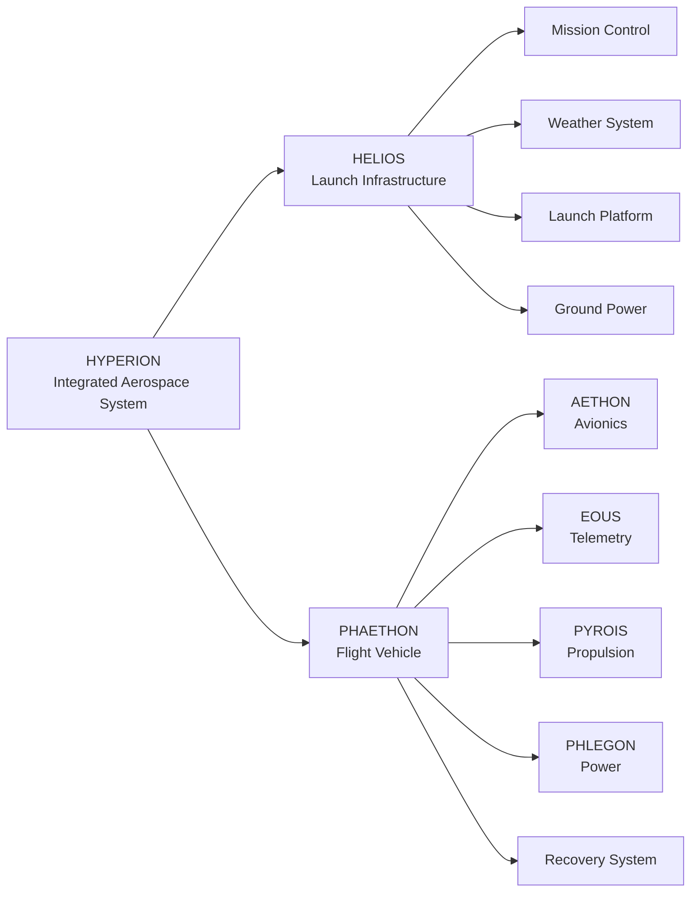

# Hyperion Integrated Aerospace System


---

## Overview

**Hyperion Integrated Aerospace System** is a student-developed autonomous aerospace platform designed to integrate:

- Autonomous launch computation
- Environmental sensing
- Flight simulation
- Guided launch positioning
- Embedded avionics
- Telemetry
- Propulsion integration
- Recovery systems

What began as a small summer engineering project has expanded into a full-scale aerospace systems architecture combining software, electronics, mechanical design, simulation, and embedded systems.

The system is divided into two primary segments:

- **HELIOS** — Ground launch infrastructure
- **PHAETHON** — Flight vehicle

Together they form the complete **Hyperion Aerospace System**.

---

# System Architecture



---

# System Components

# HELIOS

## Launch Infrastructure

HELIOS is the ground segment responsible for mission preparation, trajectory computation, environmental measurement, and launch control.

---

## Ground Computation Complex

**Purpose:** Mission planning and trajectory optimization

Components:

- Raspberry Pi 4
- Flight simulation software
- Launch trajectory calculations
- Wind compensation algorithms
- Mission control software
- Guidance calculations

Responsibilities:

- Calculate launch profiles
- Process environmental data
- Predict drift
- Optimize launch parameters

---

## Ground Power System

Portable power architecture for field operation.

Components:

- 3S 18650 battery pack
- IP2368 charging system
- Buck conversion system
- Power distribution

Responsibilities:

- Supply regulated power
- Support remote operation
- Separate high-current and logic power domains

---

## Launch Control System

Responsible for controlling launch platform movement and safety systems.

Components:

- Arduino Nano controller
- Pan/tilt firmware
- Safety interlocks
- Launch state monitoring

---

## Launch Platform

Mechanical launch positioning system.

Components:

- Dual NEMA 17 pan/tilt assembly
- Mechanical alignment system
- Launch rail assembly

Purpose:

- Adjust launch azimuth
- Adjust launch elevation
- Compensate for environmental conditions

---

# Ground Support Systems

## Wind Measurement System

Provides real-time atmospheric data.

Components:

- Anemometer
- Wind direction measurement
- MCP3008 ADC
- Weather processing software

Data provided:

- Wind speed
- Wind direction
- Atmospheric conditions

Used for:

- Trajectory correction
- Drift prediction
- Launch optimization

---

## Ground Telemetry Station

Responsible for receiving and displaying flight information.

Components:

- RF receiver
- Mission data display
- Flight monitoring interface

---

# PHAETHON

## Flight Vehicle

PHAETHON is the airborne segment of Hyperion.

It contains:

- Avionics
- Telemetry
- Propulsion
- Power
- Recovery systems

---

# AETHON

## Flight Computer / Avionics Core

AETHON is the onboard computational system.

Components:

- Arduino Nano flight computer
- Embedded flight software
- MPU-6050 IMU
- BME280 atmospheric sensor

Responsibilities:

- Flight state estimation
- Sensor fusion
- Data logging
- Mission logic
- Recovery decision logic

---

## Sensor Systems

### MPU-6050

Provides:

- Acceleration data
- Angular velocity
- Orientation estimation

---

### BME280

Provides:

- Pressure measurement
- Temperature measurement
- Altitude estimation

---

# EOUS

## Communication & Telemetry System

EOUS manages communication between the flight vehicle and ground station.

Components:

- RF transceiver
- Antenna system
- Telemetry downlink
- Packet processing

Responsibilities:

- Transmit flight data
- Receive commands
- Monitor communication quality
- Provide emergency tracking

---

# PYROIS

## Propulsion System

PYROIS manages the propulsion architecture.

Components:

- Motor assembly
- Motor cartridge interface
- Motor retention system
- Ignition interface
- Thermal protection
- Propulsion mounting structure

Responsibilities:

- Secure motor integration
- Provide ignition control
- Collect thrust performance data
- Support interchangeable motor systems

---

# PHLEGON

## Onboard Power System

PHLEGON provides electrical power management for the flight vehicle.

Components:

- LiPo battery system
- Battery protection
- Voltage regulation
- Power distribution
- Current monitoring
- Thermal monitoring

Power rails:

- Avionics power rail
- Telemetry power rail
- Sensor power rail

Responsibilities:

- Stable power delivery
- Battery monitoring
- Electrical protection

---

# Recovery System

The recovery system provides safe vehicle return after flight.

Components:

- Parachute assembly
- Deployment mechanism
- Recovery hardware
- Landing protection
- Recovery tracking

Responsibilities:

- Controlled descent
- Vehicle recovery
- Post-flight analysis

---

# Software Architecture

## Flight Simulation

The Hyperion simulation environment models:

- Atmospheric effects
- Wind drift
- Rocket dynamics
- Drag
- Gravity variation
- Propulsion performance

Current models include:

- RK4 numerical integration
- Wind altitude lookup tables
- Thrust curve interpolation
- Descent drift prediction

---

# Electronics Architecture

## Ground System

```
Battery System
      |
      |
Power Distribution
      |
      +---- Raspberry Pi 4
      |
      +---- Arduino Nano
              |
              +---- NEMA 17 Drivers
```

---

## Flight System

```
Battery
   |
Power Regulation
   |
   +---- AETHON Flight Computer
   |
   +---- EOUS Telemetry
   |
   +---- Sensors
```

---

# Engineering Goals

## Current Goals

- Develop accurate flight simulation
- Implement automated trajectory calculation
- Build autonomous launch positioning
- Develop telemetry system
- Integrate flight avionics

---

## Future Goals

- Improved aerodynamic modeling
- Closed-loop guidance
- Advanced sensor fusion
- Improved recovery systems
- Expanded telemetry capabilities
- Higher fidelity simulation

---

# Development Philosophy

Hyperion is built around the idea of integrating multiple engineering disciplines into one cohesive aerospace platform:

- Aerospace engineering
- Embedded systems
- Electrical engineering
- Mechanical design
- Software development
- Control systems
- Simulation

The goal is not simply to build a rocket, but to develop a complete aerospace system.

---

# Project Naming

The Hyperion system uses names inspired by Greek mythology:

| Name | Component | Meaning |
|-|-|-|
| Hyperion | Complete aerospace system | Titan associated with observation |
| Helios | Launch infrastructure | Sun god |
| Phaethon | Flight vehicle | Son of Helios who drove the sun chariot |
| Aethon | Avionics | One of the horses of Helios' chariot |
| Eous | Telemetry | One of the horses of Helios' chariot |
| Pyrois | Propulsion | One of the horses of Helios' chariot |
| Phlegon | Power system | One of the horses of Helios' chariot |

---

# License

This project is currently under development.
