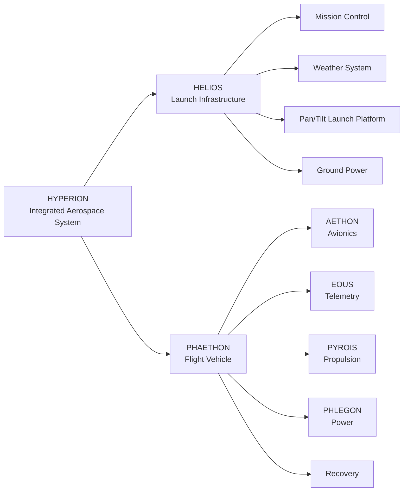

# Hyperion Integrated Aerospace System

Hyperion is a student-developed autonomous aerospace platform integrating:

- Flight simulation
- Automated launch computation
- Environmental sensing
- Embedded avionics
- Telemetry
- Propulsion systems
- Recovery systems

Originally started as a summer engineering project, Hyperion has expanded into a complete aerospace system combining software, electronics, mechanical design, and simulation.

---

# System Architecture

---

# System Components

## HELIOS — Launch Infrastructure

Ground-based launch system responsible for mission computation, environmental sensing, and launch positioning.

### Main Systems

**Mission Control**
- Raspberry Pi 4
- Flight simulation
- Wind processing
- Trajectory calculation

**Launch Platform**
- Arduino Nano controller
- Dual NEMA 17 pan/tilt system
- Launch rail alignment

**Ground Support**
- Wind measurement system
- RF ground station
- Portable power system

---

# PHAETHON — Flight Vehicle

The airborne platform containing avionics, propulsion, communication, and power systems.

## AETHON — Avionics

Flight computer responsible for:

- Sensor processing
- Flight state estimation
- Data logging
- Mission logic

Hardware:
- Arduino Nano
- MPU-6050 IMU
- BME280 sensor

---

## EOUS — Telemetry

Communication system responsible for:

- RF communication
- Flight data transmission
- Ground link monitoring

---

## PYROIS — Propulsion

Propulsion integration system.

Responsible for:

- Motor mounting
- Ignition interface
- Thermal protection
- Thrust characterization

---

## PHLEGON — Power

Onboard electrical system.

Responsible for:

- Battery management
- Voltage regulation
- Power distribution
- Electrical monitoring

---

## Recovery System

Responsible for:

- Controlled descent
- Deployment system
- Recovery tracking

---

# Engineering Focus

Hyperion combines:

- Aerospace engineering
- Embedded systems
- Electrical engineering
- Control systems
- Software development
- Mechanical design

Current development focuses on:

- Flight simulation accuracy
- Autonomous launch positioning
- Telemetry integration
- Avionics development

---

# Project Naming

| Name | System | Inspiration |
|-|-|-|
| Hyperion | Complete system | Titan associated with observation |
| Helios | Launch infrastructure | Sun god |
| Phaethon | Rocket vehicle | Son of Helios |
| Aethon | Avionics | Horse of Helios' chariot |
| Eous | Telemetry | Horse of Helios' chariot |
| Pyrois | Propulsion | Horse of Helios' chariot |
| Phlegon | Power | Horse of Helios' chariot |

---

More detailed engineering documentation will be maintained in `/docs`.
