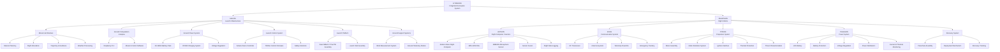

```mermaid
graph TD

H[HYPERION<br>Integrated Aerospace System]

%% MAIN DIVISIONS
H --> HELIOS[HELIOS<br>Launch Infrastructure]
H --> PHAETHON[PHAETHON<br>Flight Vehicle]

%% MISSION CONTROL
HELIOS --> MISSION[Mission Architecture]
MISSION --> PLAN[Mission Planning]
MISSION --> SIM[Flight Simulation]
MISSION --> GUIDANCE[Trajectory & Guidance]
MISSION --> WEATHER[Weather Processing]


%% HELIOS SUBSYSTEMS
HELIOS --> COMPUTE[Ground Computation Complex]
COMPUTE --> RPI[Raspberry Pi 4]
COMPUTE --> SOFTWARE[Mission Control Software]

HELIOS --> POWER[Ground Power System]
POWER --> BATTERY[3S 18650 Battery Pack]
POWER --> CHARGE[IP2368 Charging System]
POWER --> CONVERT[Voltage Regulation]

HELIOS --> LAUNCH[Launch Control System]
LAUNCH --> CONTROL[Arduino Nano Controller]
LAUNCH --> PAN[Tilt/Pan Control Firmware]
LAUNCH --> SAFETY[Safety Interlocks]

HELIOS --> PLATFORM[Launch Platform]
PLATFORM --> NEMA[Dual NEMA 17 Pan/Tilt Assembly]
PLATFORM --> RAIL[Launch Rail Assembly]

HELIOS --> SUPPORT[Ground Support Systems]
SUPPORT --> WIND[Wind Measurement System]
SUPPORT --> TELEMETRY[Ground Telemetry Station]


%% PHAETHON SUBSYSTEMS
PHAETHON --> AETHON[AETHON<br>Flight Computer / Avionics]
PHAETHON --> EOUS[EOUS<br>Communication System]
PHAETHON --> PYROIS[PYROIS<br>Propulsion System]
PHAETHON --> PHLEGON[PHLEGON<br>Power System]
PHAETHON --> RECOVERY[Recovery System]


%% AETHON
AETHON --> FLIGHTCPU[Arduino Nano Flight Computer]
AETHON --> IMU[MPU-6050 IMU]
AETHON --> ATMOS[BME280 Atmospheric Sensor]
AETHON --> FUSION[Sensor Fusion]
AETHON --> LOGGING[Flight Data Logging]


%% EOUS
EOUS --> RF[RF Transceiver]
EOUS --> ANTENNA[Antenna System]
EOUS --> LINK[Telemetry Downlink]
EOUS --> BEACON[Emergency Tracking]


%% PYROIS
PYROIS --> MOTOR[Motor Assembly]
PYROIS --> RETENTION[Motor Retention System]
PYROIS --> IGNITION[Ignition Interface]
PYROIS --> THERMAL[Thermal Protection]
PYROIS --> CHARACTERIZATION[Thrust Characterization]


%% PHLEGON
PHLEGON --> LIPO[LiPo Battery]
PHLEGON --> BMS[Battery Protection]
PHLEGON --> REGULATOR[Voltage Regulation]
PHLEGON --> DISTRIBUTION[Power Distribution]
PHLEGON --> MONITOR[Current & Thermal Monitoring]


%% RECOVERY
RECOVERY --> PARACHUTE[Parachute Assembly]
RECOVERY --> DEPLOY[Deployment Mechanism]
RECOVERY --> TRACKING[Recovery Tracking]
```
