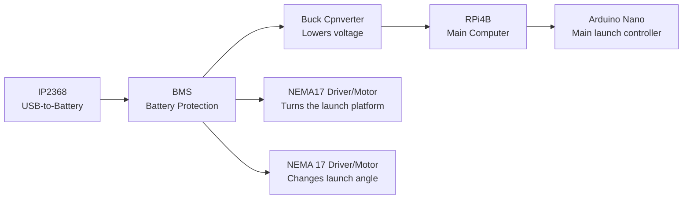

# Power Architecture
This explains the layout of the whole system's power architecture

Here's a more technical and detailed description of the power layout. Keep in mind this schematic is SUPER simplified and only show the rough idea of the power system.
[Helios Power Schematic.pdf](https://github.com/user-attachments/files/30455144/Helios.Power.Schematic.pdf)
