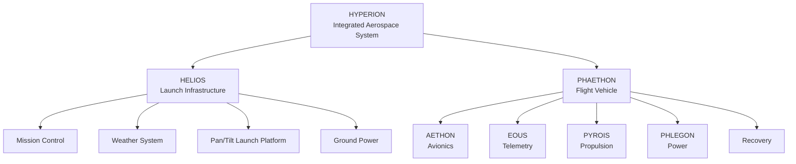

# Power Architecture
This explains the layout of the whole system's power architecture

```mermaid
graph TD

H[HYPERION<br>Integrated Aerospace System]

H --> HELIOS[HELIOS<br>Launch Infrastructure]
H --> PHAETHON[PHAETHON<br>Flight Vehicle]

HELIOS --> CONTROL[Mission Control]
HELIOS --> WEATHER[Weather System]
HELIOS --> PLATFORM[Pan/Tilt Launch Platform]
HELIOS --> POWER[Ground Power]

PHAETHON --> AETHON[AETHON<br>Avionics]
PHAETHON --> EOUS[EOUS<br>Telemetry]
PHAETHON --> PYROIS[PYROIS<br>Propulsion]
PHAETHON --> PHLEGON[PHLEGON<br>Power]
PHAETHON --> RECOVERY[Recovery]
```
