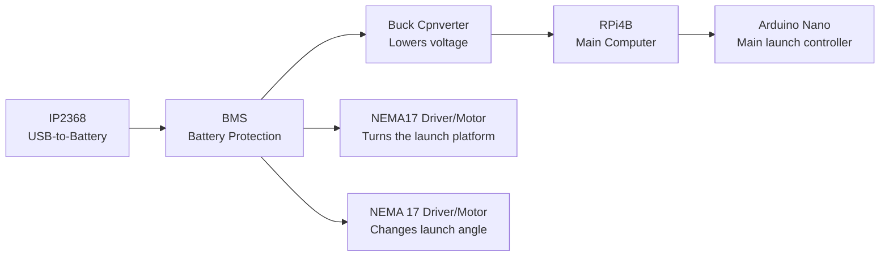

# Power Architecture
This explains the layout of the whole system's power architecture

## More Technical Schematic
Keep in mind this schematic is SUPER simplified and only show the rough idea of the power system.

